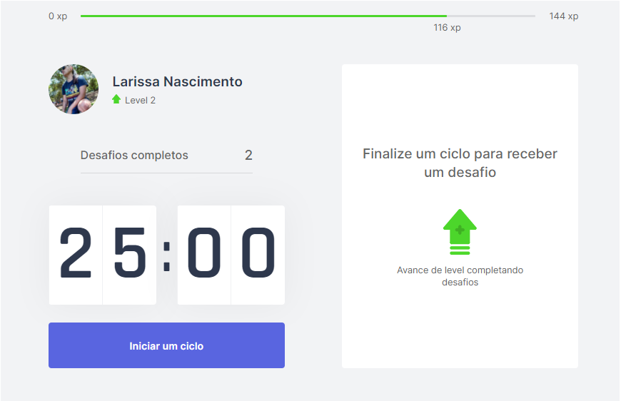

<h1 align="center">Move-it</h1>

  ⌚️ Um projeto baseado no metodo de concentração conhecido como metodo de pomodoro, que consiste 
  em focar em uma tarefa por 25 minutos sem interrupções. Após o periodo de concentração será
  sugerido alguns exercícios físicos para o usuário, e com isso podendo elevar seu nivel no app.

